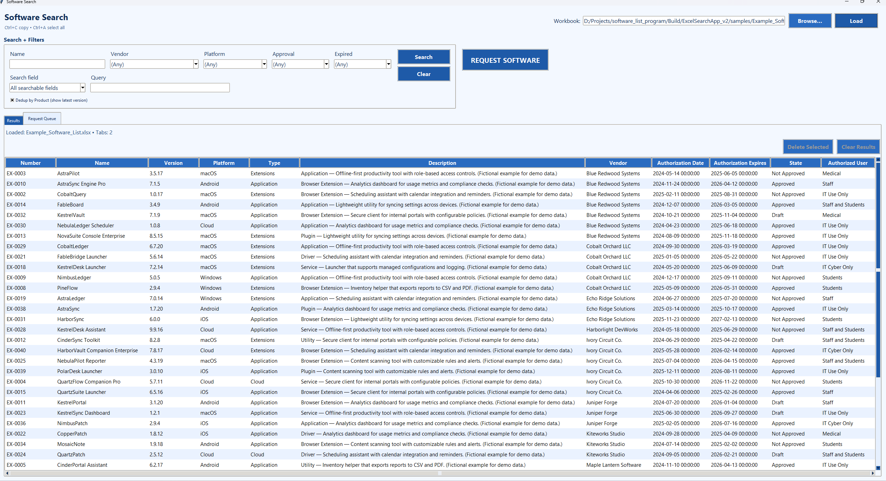
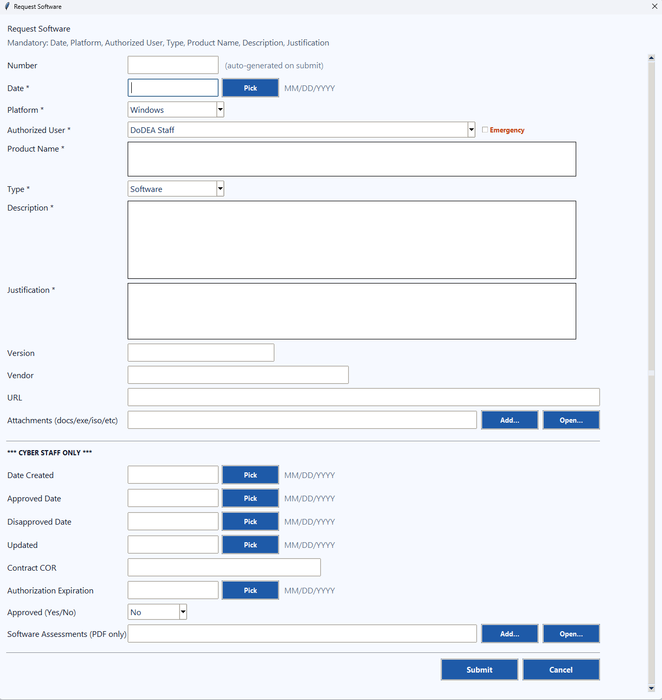
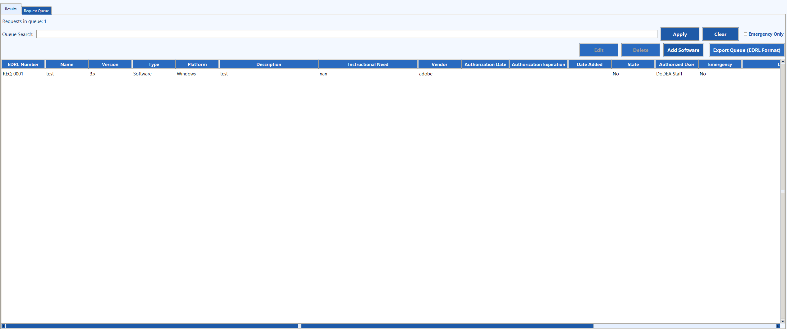

# SoftWare List Management App

A small Python GUI tool for searching a software list in Excel and submitting a software request via a form-style workflow.

This repo includes **fictional demo data** in `/samples` so you can test the app without using real Intune exports.

## Screenshots

#Main View

# Request Form

# Request Queue


## What's in this repo

- `excel_search_gui.py` — main GUI application
- `request_form_geometry.json` — saved UI layout/geometry for the request form
- `requirements.txt` — Python dependencies
- `samples/` — demo Excel file(s) with fake/random software entries (safe for Git)

## Requirements

- Windows 10/11
- Python 3.10+ recommended

## Setup

From the repo root:

```bash
python -m pip install --upgrade pip
python -m pip install -r requirements.txt
```

## Quick Start

```bash
python -m pip install -r requirements.txt
python excel_search_gui.py
```

## Demo Excel file

Use the fictional example Excel sheet in:

- `samples/Example_Software_List.xlsx`

The demo sheet uses the dropdown values:

- **Platform:** Windows, iOS, Android, macOS, Cloud  
- **Type:** Cloud, Application, Extensions  
- **Authorized User:** IT Use Only, IT Cyber Only, Staff, Students, Staff and Students, Medical

## Notes / Safety

Do not commit real Intune exports or any sensitive data to this repo.

Keep production data outside the repo, or ensure it is ignored by `.gitignore`.

## License

MIT — see `LICENSE`.
